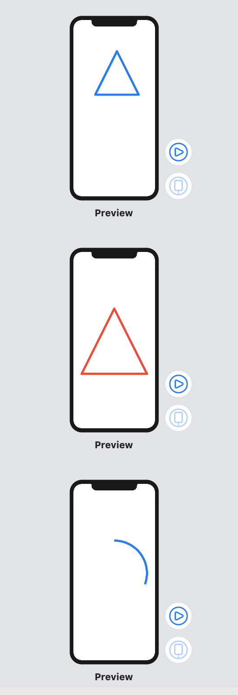
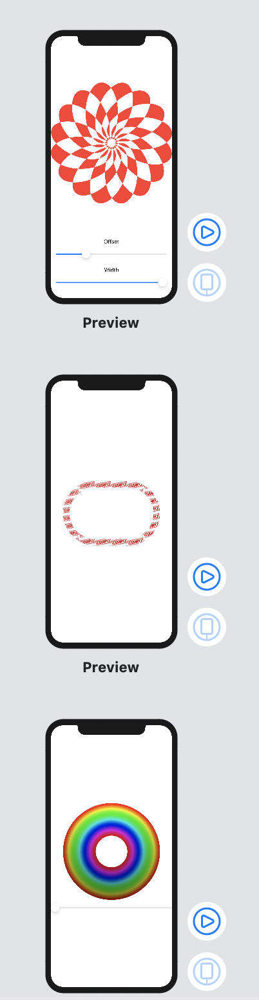

# Drawing

### Day 43 
- Drawing: Introduction
- Creating custom paths with SwiftUI
- Paths vs shapes in SwiftUI
- Adding strokeBorder() support with InsettableShape

### Day 44
- Transforming shapes using CGAffineTransform and even-odd fills
- Creative borders and fills using ImagePaint
- Enabling high-performance Metal rendering with drawingGroup()

