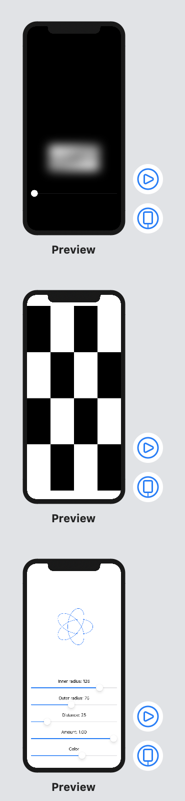

# Drawing

### Day 43 
- Drawing: Introduction
- Creating custom paths with SwiftUI
- Paths vs shapes in SwiftUI
- Adding strokeBorder() support with InsettableShape

### Day 44
- Transforming shapes using CGAffineTransform and even-odd fills
- Creative borders and fills using ImagePaint
- Enabling high-performance Metal rendering with drawingGroup()

### Day 45
- Special effects in SwiftUI: blurs, blending, and more
- Animating simple shapes with animatableData
- Animating complex shapes with AnimatablePair
- Creating a spirograph with SwiftUI

